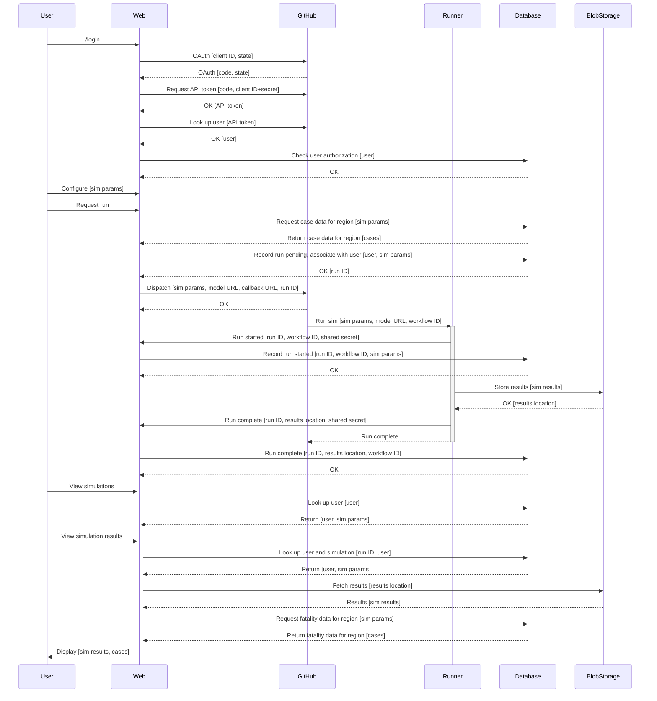

# User Flow

This document describes the means by which a user accesses the web application,
queues a simulation run, and then views the results.
It summarizes the calls made between components of the system and the data that is passed by those calls.

  
Sequence Diagram Source

## Legend for data labels

The labels in `[square brackets]` describe the data being passed between components of the system.

- `API token`: GitHub API token for a logged-in user
- `cases`: Infection and death counts for a region. These are recorded in the DB from public sources.
- `callback URL`: URL of the web application
- `client ID`: GitHub client ID for the web application
- `client secret`: GitHub client secret for the web application
- `code`: OAuth access code for a logged-in user
- `model URL`: GitHub Package Registry URL for a Docker image that runs an epidemiological model
- `run ID`: ID number for a simulation run in the database
- `shared secret`: A secret key for shared communication between the web application and model runner.
- `sim params`: Parameters for running a simulation. These include a region, user-supplied label, list of proposed policy interventions and dates, and epidemiological parameters.
- `sim results`: Results of running a simulation. These include the simulation parameters along with predicted infection and death counts over a time period.
- `results location`: Azure Blob Storage location for a set of simulation results
- `state`: OAuth state. Sent as a JWT encrypted with a session secret and nonce.
- `user`: GitHub user ID and login name. After login, these are stored in a session cookie.
- `workflow ID`: GitHub Actions workflow run ID number for a simulation run on the control plane repository
